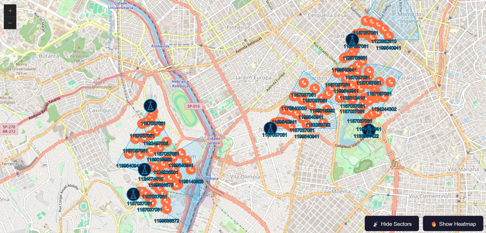

# Overview

A GIS investigation map that visualizes 112 phone call records from a real CDR (Call Detail Record) dataset across 6 cell tower sites in São Paulo, Brazil. CDR data is used by investigators to reconstruct the physical movement and communication patterns of persons of interest — this map makes those patterns visible at a glance.

Each marker represents a single call event, placed inside the antenna sector that handled it. Markers cluster at low zoom and split into individual call events as you zoom in. A heatmap toggle shows call density by tower.

**How to use:**
- Zoom in to split clusters into individual call markers
- Click any marker for full call details: origin, destination, date, time, duration, and tower
- Click any tower icon for station ID, address, and total calls handled
- Click any sector wedge for azimuth, radius, and call count
- Use **🔥 Show Heatmap** to switch between markers and density view
- Use **📡 Hide Sectors** to toggle antenna coverage wedges

**Why clustering:** All 112 calls map to only 6 tower coordinates — without clustering, every marker would stack invisibly on the same 6 points. ArcGIS native `featureReduction` groups them automatically and splits on zoom.

[Software Demo Video](http://youtube.link.goes.here)

# Development Environment

- VS Code with [Live Server](https://marketplace.visualstudio.com/items?itemName=ritwickdey.LiveServer) extension
- Vanilla JavaScript (ES Modules — no framework, no build tool)
- [ArcGIS Maps SDK for JavaScript 5.0](https://developers.arcgis.com/javascript/latest/) via CDN

**How to run:**

1. Clone the repository
2. Copy `js/config.example.js` to `js/config.js` and paste your free ArcGIS API key from [developers.arcgis.com](https://developers.arcgis.com)
3. Open the project root in VS Code and click **Go Live**
4. Open `http://localhost:5500` in your browser

> The project must be served from the **project root folder** — ES modules don't load over `file://`.

No install steps, no build process.

# Useful Websites

* [ArcGIS Maps SDK for JavaScript — API Reference](https://developers.arcgis.com/javascript/latest/api-reference/)
* [GeoJSONLayer Documentation](https://developers.arcgis.com/javascript/latest/api-reference/esri-layers-GeoJSONLayer.html)
* [FeatureReduction Clustering](https://developers.arcgis.com/javascript/latest/api-reference/esri-layers-support-FeatureReductionCluster.html)
* [Get a free ArcGIS API key](https://developers.arcgis.com/)

# Future Work

* Map legend — explain markers, tower icons, sector wedges, and heatmap gradient
* Filter by caller — highlight one phone number's events across the map to trace individual movement
* Timeline slider — filter by date to animate movement patterns across the 10-day window
* Info panel — summary of total calls, unique callers, active towers, and date range
* Basemap toggle — switch between street map and satellite imagery

# AI Disclosure
 
* Helped overlap 6-coordinate problem that drove the clustering decision.
* Assisted with ArcGIS SDK setup, sector wedge geometry and jitter logic.
